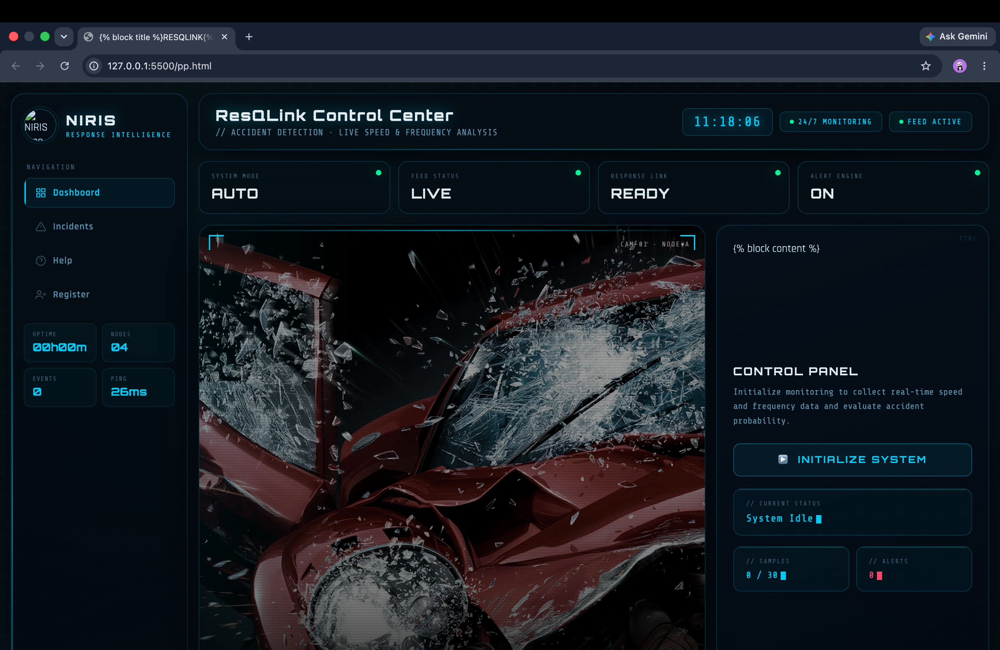

# 🚑 ResQLink - AI Powered Accident Detection & Emergency Response System
## Dashboard


# 📌 Overview

ResQLink is an AI-powered accident detection and emergency response system that continuously monitors vehicle movement using computer vision and speed-frequency analysis.

The system detects accidents in real time and immediately triggers emergency response procedures.

The dashboard provides a futuristic command center where operators can monitor live traffic data, vehicle speed, accident alerts, and emergency status.

---

# 🎯 Problem Statement

Road accidents often remain unnoticed for several minutes.

The delay in informing hospitals and emergency services causes loss of lives.

ResQLink minimizes response time using AI-powered accident detection.

---

# ✨ Features

## 🚗 Real-Time Vehicle Monitoring

- Live traffic monitoring
- Continuous vehicle tracking
- Speed estimation
- Frequency analysis

---

## 🚨 Accident Detection

- AI-based accident prediction
- Detects abnormal vehicle movement
- Generates instant alerts
- Emergency notification system

---

## 📊 Live Dashboard

Dashboard includes:

- Live camera feed
- Vehicle speed data
- Frequency data
- Alert status
- Event counter
- System uptime
- Live clock
- Network ping
- Monitoring status

---

## 🎨 Modern UI

- Cyberpunk Interface
- Responsive Layout
- Animated Dashboard
- Live Statistics
- Glassmorphism Design
- Neon Effects

---

# 🏗 Project Architecture

```
                Camera Feed
                     │
                     ▼
              Vehicle Detection
                     │
                     ▼
          Speed & Frequency Analysis
                     │
                     ▼
          Accident Detection Engine
                     │
          ┌──────────┴──────────┐
          ▼                     ▼
 Emergency Alert         Dashboard Update
          │                     │
          ▼                     ▼
 Hospital Notification     Live UI
```

---

# 🛠 Tech Stack

## Frontend

- HTML5
- CSS3
- JavaScript
- Jinja2 Templates

## Backend

- Python
- Flask

## AI / Computer Vision

- OpenCV
- NumPy

## Future Integration

- YOLOv8
- TensorFlow
- MediaPipe
- Firebase
- Twilio API
- Google Maps API

# ⚙️ Installation

Clone repository

```bash
git clone https://github.com/Vikas-tiwari-dot/resqlink
```

Go inside folder

```bash
cd ResQLink
```

Create Virtual Environment

```bash
python -m venv venv
```

Activate

Windows

```bash
venv\Scripts\activate
```

Linux / Mac

```bash
source venv/bin/activate
```

Install packages

```bash
pip install -r requirements.txt
```

Run project

```bash
python app.py
```

Open

```
http://127.0.0.1:5000
```

---

# 🖥 Dashboard Components

### Sidebar

- Dashboard
- Incidents
- Help
- Register

### Statistics

- System Mode
- Feed Status
- Alert Engine
- Response Link

### Monitoring

- Live Feed
- Speed Data
- Frequency Data
- Detection Result

### Status

- System Idle
- Gathering Data
- Analyzing
- Accident Detected

---

# ⚡ Working Flow

1. Start Monitoring
2. Collect Vehicle Data
3. Calculate Speed
4. Calculate Frequency
5. Detect Collision
6. Generate Alert
7. Notify Hospital
8. Update Dashboard

---

# 📈 Dashboard Workflow

```
Initialize System
        │
        ▼
Collect Live Data
        │
        ▼
Speed Calculation
        │
        ▼
Frequency Analysis
        │
        ▼
Accident Detection
        │
        ▼
Emergency Alert
        │
        ▼
Hospital Response
```

---

# 🔮 Future Scope

- YOLOv11 Integration
- AI Severity Prediction
- GPS Tracking
- Ambulance Live Tracking
- Voice Emergency Assistant
- SMS Alerts
- WhatsApp Alerts
- Firebase Cloud Notifications
- Drone Surveillance
- Smart City Integration
- IoT Vehicle Sensors
- Automatic Police Notification

---

# 📷 Screenshots

Add project screenshots here.

```
screenshots/

dashboard.png

accident_detection.png

live_monitoring.png

alert.png
```

---

# 👨‍💻 Developed By

**Vikas Tiwari**

B.Tech CSE

ABES Institute of Technology

---

# ⭐ Key Highlights

✅ AI Powered Accident Detection

✅ Real-Time Monitoring

✅ Emergency Response

✅ Smart Dashboard

✅ Flask Backend

✅ Computer Vision

✅ Modern Responsive UI

---

# 📜 License

This project is developed for educational, research, and hackathon purposes.

---

# ❤️ Thank You

If you like this project, don't forget to ⭐ the repository.